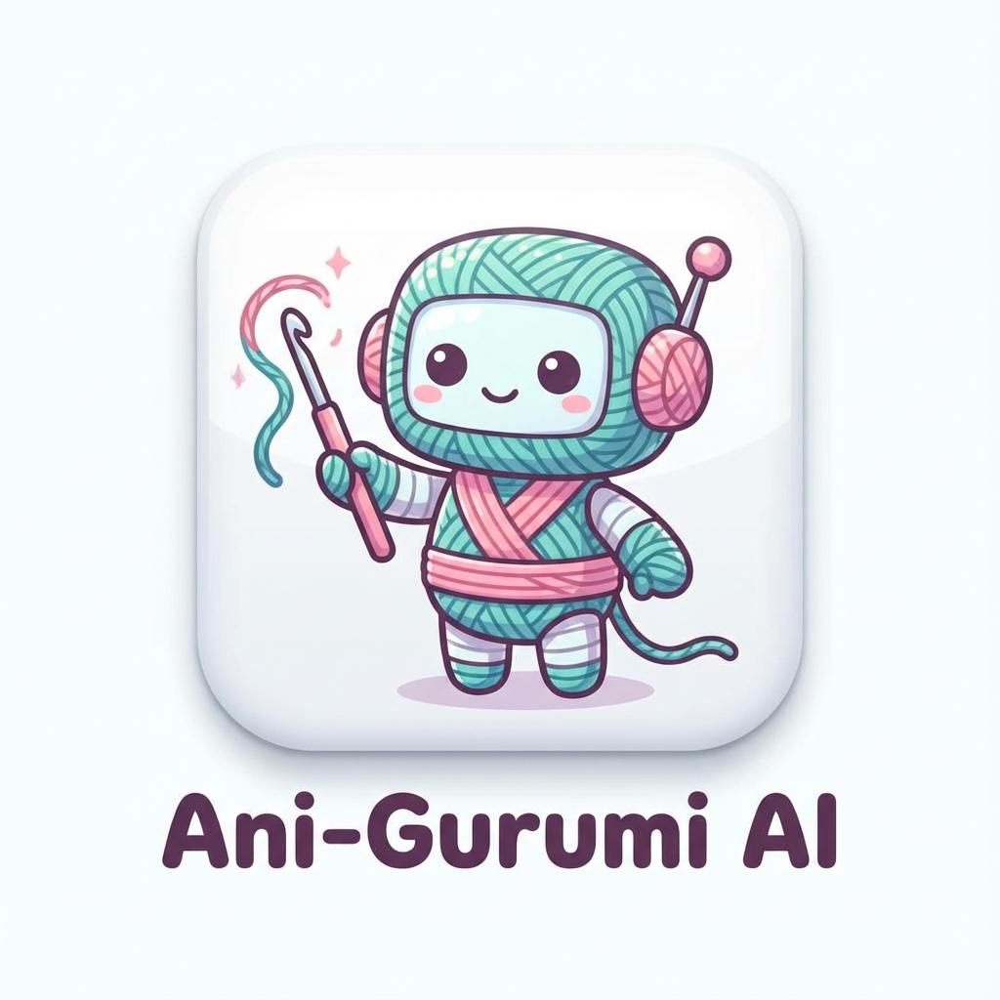

<div align="center">
  
  <h1>Ani-Gurumi AI</h1>
  <p><strong>An AI-driven app that converts anime images into crochet patterns (Amigurumi) with a twist! 🧶✨</strong></p>
</div>

---

## 🚀 Features

*   🤖 **AI-Powered:** Uses **Google Gemini 2.0 Flash** to analyze images and generate detailed crochet patterns.
*   📸 **Camera Ready:** Snap a photo of your favorite character directly in the app or upload an existing image.
*   ⚔️ **Hybrid Mode:** For complex details (like weapons or accessories), the AI suggests **3D-printable parts (STL)** and provides direct search links to Thingiverse.
*   📝 **Quest Log:** Follow the pattern step-by-step with an interactive checklist that saves your progress automatically.
*   💬 **Pattern Editor:** Chat with **Anigurobo** (the AI mascot) to tweak and adjust the pattern in real-time (e.g., "Make the arms longer").
*   💾 **Inventory:** Save your generated patterns and load them later to continue working.

## 🛠️ Tech Stack

*   **Python**
*   **Streamlit** (UI Framework)
*   **Google Generative AI** (Gemini API)
*   **Umami Analytics** (Privacy-friendly tracking)

## 📦 Installation & Setup

1.  **Clone the repository:**
    ```bash
    git clone https://github.com/Papagarn92/Ani-Gurumi-AI.git
    cd Ani-Gurumi-AI
    ```

2.  **Install dependencies:**
    ```bash
    pip install -r requirements.txt
    ```

3.  **Configure API Key:**
    *   Create a folder named `.streamlit` in the project root.
    *   Create a file named `secrets.toml` inside `.streamlit`.
    *   Add your Google Gemini API key:
        ```toml
        GEMINI_API_KEY = "your_api_key_here"
        ```
    *   *(Optional)* Add Umami Analytics keys:
        ```toml
        UMAMI_SCRIPT_URL = "your_umami_url"
        UMAMI_WEBSITE_ID = "your_website_id"
        ```

4.  **Run the app:**
    ```bash
    streamlit run app.py
    ```

## 📄 License

This project is open source. Feel free to fork and contribute! 🧶
